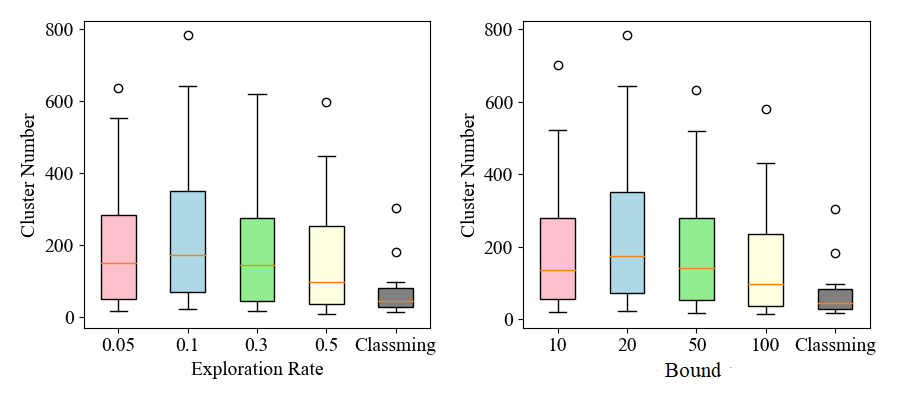
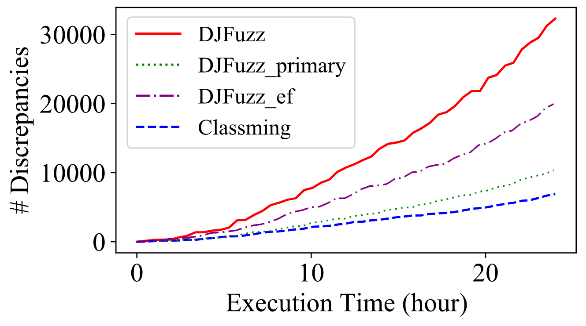

# SJFuzz
 Discrepancy-driven JVM Fuzzing

## Issues Found By SJFuzz

| Issues                                                       | Impact Versions                                  | Confirmed                                        | Link                                                         |
| ------------------------------------------------------------ | ------------------------------------------------ | ------------------------------------------------ | ------------------------------------------------------------ |
| J9 (1.8.0_275-b01) crashed while J9 (9.0.4) and J9 (11.0.9+11) did not. | J9 (1.8.0_275)                                   | J9 (1.8.0_275)                                   | https://github.com/eclipse/openj9/issues/11683               |
| J9 failed to pass the JUnit test after throwing StackOverflowError for a previous test. When removing that "previous test", J9 pass the test. | J9: 8u232, 9.0.4, 11.0.5                         | J9: 8u232, 9.0.4, 11.0.5                         | https://github.com/eclipse/openj9/issues/9381                |
| J9 (1.8.0_275) threw an AssertionError; J9 (11.0.9) threw an ArrayIndexOutOfBoundsException; OpenJDK (8u275, 9.0.4, 11.0.9) and J9 (9.0.4) threw an VerifyError; | J9 (1.8.0_275) and J9 (11.0.9)                   |             J9 (1.8.0_275) and J9 (11.0.9)                                     | https://github.com/eclipse/openj9/issues/11685               |
| J9 (8u275, 11.0.9) passed the JUnit test while OpenJDK (8u275, 9.0.4, 11.0.9) and J9 (9.0.4) threw a VerifyError. | J9 (8u275, 11.0.9)                               | J9 (8u275, 11.0.9)                               | https://github.com/eclipse/openj9/issues/11684               |
| J9: failed to throw VerifyError?                             | J9(1.8.0_232) J9(11.0.5)                         | J9(1.8.0_232) J9(11.0.5)                         | https://github.com/eclipse/openj9/issues/9385                |
| OpenJDK 8u232, 9.0.4 executed a different program path compared to OpenJDK11, J9 | OpenJDK 8u232, 9.0.4                             | | https://bugs.openjdk.java.net/browse/JDK-8259961             |
| J9 (1.8.0_275) and J9 (11.0.9) failed to threw AssertionError | J9 (1.8.0_275)  J9 (11.0.9)                      | J9 (1.8.0_275) J9 (11.0.9)                       | https://github.com/eclipse/openj9/issues/11721               |
| J9 (11.0.9) crashed while executing a test file on a heavy-load server. | J9 (11.0.9)                                      | J9 (11.0.9)                                      | https://github.com/eclipse/openj9/issues/11725               |
| JDK can not find MANIFEST.MF files by ClassLoader.getResources() | OracleJDK6, OracleJDK7, OracleJDK8, OpenJDK8u232 | OracleJDK6, OracleJDK7, OracleJDK8, OpenJDK8u232 | https://bugs.java.com/bugdatabase/view_bug.do?bug_id=JDK-8244083 |
| J9 failed to execute all JUnit tests in a test file (caused by initializationError) | J9: 8u232, 9.0.4, 11.0.5                         |  J9: 8u232, 9.0.4, 11.0.5                                                 | https://github.com/eclipse/openj9/issues/9357                |
| In JUnit tests, J9 said can not find the definition of class which is actually found in previous tests? | J9: 8u232, 9.0.4, 11.0.5                         |  same issue as in 9357                                                | https://github.com/eclipse/openj9/issues/9336                |
| J9 failed to detect that the class is not defined during the loading stage? | J9: 8u232, 9.0.4, 11.0.5                         |     same issue as in 9357                                             | https://github.com/eclipse/openj9/issues/9323                |
| Dragonwell (1.8.0_275): getMessage() for an ArrayIndexOutOfBoundsException instance is null | Dragonwell (1.8.0_275)                           |                                                  | https://github.com/alibaba/dragonwell8/issues/186            |
| J9 (9.0.4) threw NullPointerException while other JVMs threw AssertionError. | J9 (9.0.4)                                       |                                                  | https://github.com/eclipse/openj9/issues/11723               |
| Dragonwell8.2.2: ClassLoader.getResources() can not work properly | Dragonwell8.2.2                                  |                                                  | https://github.com/alibaba/dragonwell8/issues/99             |
| OpenJDK (8u232, 9.0.4, 11.0.5) skipped an erroneous instruction | OpenJDK (8u232, 9.0.4, 11.0.5)                   |                                                  | https://bugs.java.com/bugdatabase/view_bug.do?bug_id=JDK-8243483 |
| A possible bug in Verification: Dragonwell skipped an erroneous instruction? | Dragonwell8.2.2 Dragonwell11.0.5.1               |                                                  | https://github.com/alibaba/dragonwell8/issues/97             |
| J9 failed to throw the IllegalMonitorStateException          | J9: 8u232, 9.0.4, 11.0.5                         |                                                  | https://github.com/eclipse/openj9/issues/9276                |
| J9 Verification Issue: did not check uninitialized register? | J9 (8u232)                                       |                                                  | https://github.com/eclipse/openj9/issues/9271                |
| A possible bug found in JVM differential testing dw          | Dragonwell8.2.2                                  |                                                  | https://github.com/alibaba/dragonwell8/issues/89             |
| OpenJDK did not report ClassFormatError when class name is illegal | OpenJDK: 8u232 8u242                             |                             | https://bugs.java.com/bugdatabase/view_bug.do?bug_id=JDK-8242352 |
| OpenJDK 8u275 crashed on a heavy-load server.                | OpenJDK 8u275                                    |                                                  | https://bugs.java.com/bugdatabase/view_bug.do?bug_id=JDK-8262342 |
| OpenJDK 9.0.4 crashed on a heavy-load server.                | OpenJDK 9.0.4                                    |                                                  | https://bugs.java.com/bugdatabase/view_bug.do?bug_id=JDK-8262343 |
| OpenJDK 11.0.9 crashed on a heavy-load server.               | OpenJDK 11.0.9                                   |                                                  | http://bugs.java.com/bugdatabase/view_bug.do?bug_id=JDK-8262344 |
| Total                                                        | 46                                               | 20                                               |                                                              |

## Performance under different configurations

In general, the data within the same cluster indicate that they are more similar to one another than the ones within other clusters. Therefore, the more clusters we have, the more diverse the overall data set is. Specifically, we adapt the widely-used DBScanClustering, a density-based clustering algorithm, to evaluate the diversity of the generated class files in terms of the generated cluster number. DBScanClustering adopts two key parameters, radius and minPts, which are both set to 1 following the studied settings from prior work.

To evaluate the impact of the parameter settings on SJFuzz, we explore different explorationRate (in Algorithm 2) and bound (in Algorithm 1) values on all our benchmarks. We show their impacts on the DBScanClustering-based diversity of the generated class files as in the following box plots. In particular, we set bound to the default 20 and investigate the impact of different explorationRates, i.e., 0.05, 0.1, 0.3 and 0.5 (left sub-figure); we also set explorationRate to the default 0.1 and investigate the impact of different bounds (right sub-figure), i.e., 10, 20, 50 and 100. In the figure, each box plot presents the diversity distribution for one configuration across all our studied subjects. We can observe that different configurations do not impact our approach much and all configurations substantially outperform classming (the gray box plots), indicating the effectiveness and stability of SJFuzz. 



<!--- ## Total Discrepancies trend with and without "discrepancy-driven" concept

 --->

## Usage

### Main-entry Mode

In the main method of `DjfuzzFrameworkResumable.java`, add following code to start test generation:

```java
fwk.process(fully_qualified_class_name, iteration_number,
            parameters_for_the_class, class_path,
            dependencies_path, jvm_options);
```

For example:

```java
fwk.process("org.sunflow.Benchmark", 50000,
            new String[]{"-bench","2","256"},
            "./sootOutput/sunflow-0.07.2/",
            "dependencies/janino-2.5.15.jar", "");
```

### JUnit-entry Mode

In the main method of `DjfuzzFrameworkResumableAdvanced.java`, add following code to start test generation:

```java
Main.useJunit(junit_jar_path, hamcrest_jar_path,
            tool_jar_path, fully_qualified_name_of_test_class);
fwk.process(fully_qualified_class_name, iteration_number,
            parameters_for_the _class, class_path,
            dependencies_path, jvm_options);
```

For example:

```java
Main.useJunit("./junit-4.12.jar", "./hamcrest-core-1.3.jar",
            "./tools.jar", "org.apache.tools.ant.AntClassLoaderTest");
fwk.process("org.apache.tools.ant.AntClassLoader", 10000, args,
            "./sootOutput/junit-ant/",
            "", "");
```

### Collect Generated Classes

Generated live mutant is in directory `./AcceptHistory/` and `./RejectHistory/`. Mutants with no live code is in `./nolivecode/`. All the generated mutants have backup file in `./tmp/`. The path of the discrepancy-inducing class file will be written into `differential-log.txt`.
